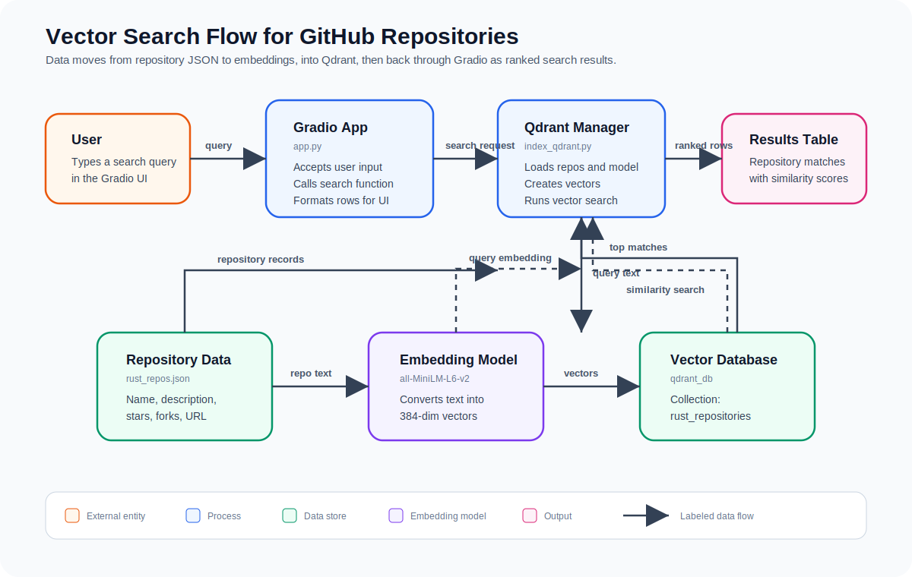

# vectorembedding
Vector qdrant with github repos as data

## Flow Diagram



## Prerequisites

- Python 3.8 or higher
- pip (Python package manager)
- Virtual environment tool (venv or conda)

## Setup Instructions

### 1. Clone the Repository

```bash
git clone https://github.com/nikhildhavale/vectorembedding.git
cd vectorembedding
```

### 2. Create a Virtual Environment

**On macOS/Linux:**
```bash
python3 -m venv venv
source venv/bin/activate
```

**On Windows:**
```bash
python -m venv venv
venv\Scripts\activate
```

### 3. Upgrade pip

```bash
pip install --upgrade pip
```

### 4. Install Dependencies

```bash
pip install -r requirements.txt
```
### 5. run 
python3 app.py on terminal at that folder
